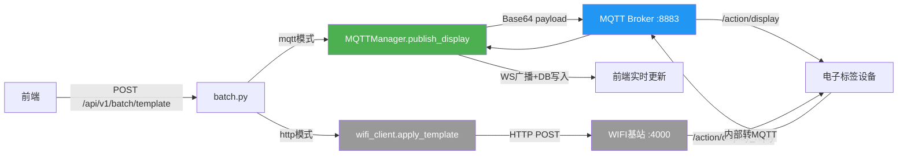

## Product Overview

将批量模板推送的通信方式从 **HTTP 转发（经基站中转）** 改为 **MQTT 直连 Broker**，解决当前 HTTP 调用基站超时(ReadTimeout)导致推送失败的问题。

## Core Features

- 在现有 `mqtt_service.py` 的 `MQTTManager` 中新增 `publish()` 方法，支持向指定 Topic 发送 Base64 编码的消息
- 修改 `batch.py` 的 `_apply_one()` 函数，将调用链从 `wifi_proxy.apply_template()`（HTTP）切换为 `mqtt_manager.publish_display()`（MQTT 直连）
- 发布 Topic：`/client/${ApiKey}/action/display`，payload 为 Base64 编码的 JSON（含 templateId + 模板数据字段）
- 复用已订阅的 `/client/${ApiKey}/action/display_reply` 接收设备执行结果反馈
- 保留原有 HTTP 实现代码不删除，通过配置或参数可回退
- 添加完整的发布日志（Topic、payload、发送结果）

## Tech Stack

- **语言**: Python 3.x (FastAPI 异步框架)
- **MQTT 客户端**: paho-mqtt（已有依赖，同步线程模式）
- **消息编码**: Base64（与 API 文档一致）
- **现有基础设施复用**: mqtt_service.py 的 MQTTManager 单例、config.py 的 Settings 配置

## Implementation Approach

### 核心策略：在 MQTTManager 上新增 publish 能力，batch.py 切换调用路径

**改动前**:

```
batch._apply_one() → wifi_proxy.apply_template() → httpx.POST /user/api/mqtt/publish/{mac}/template/{tid} → 基站(超时)
```

**改动后**:

```
batch._apply_one() → mqtt_manager.publish_display(mac, template_id, data) 
    → paho-mqtt.client.publish("/client/{apikey}/action/display", base64_payload) 
    → Broker → 设备
```

### 关键技术决策

1. **paho-mqtt 线程安全**: paho-mqtt 的 `publish()` 是线程安全的，可在 FastAPI 异步线程中直接调用。使用 `publish().is_published()` 或回调确认发布状态。

2. **消息编码**: payload = base64.b64encode(json.dumps({"templateId": tid, "data": {...}, "deviceId": mac}).encode()).decode()

3. **QoS 选择**: 使用 QoS=1（至少送达一次），保证消息可靠到达

4. **同步等待确认 vs 异步 fire-and-forget**: 采用**同步等待发布确认**方式，通过 `publish().wait_for_publish(timeout=10s)` 获取发布结果，让调用方知道是否成功投递到 Broker。这比 HTTP 超时快得多（秒级 vs 60s）。

5. **HTTP 回退策略**: 保留原 wifi_client 中的 apply_template() 不删，在 batch.py 中通过环境变量 `PUSH_MODE=mqtt|http` 控制走哪条路（默认 mqtt）。

### 架构设计



## Implementation Notes

1. **MQTTManager.publish_display() 实现**: 

- 构建 payload dict `{templateId, deviceId/mac, ...模板数据}`
- Base64 编码后调用 `self.client.publish(topic, payload, qos=1)`
- 用 `message.wait_for_publish(timeout=10)` 同步等待确认
- 返回 {success, mid} 或抛异常

2. **batch.py 改动点**:

- 第86行：`wifi_proxy.apply_template()` → `mqtt_manager.publish_display()`
- 错误处理：区分"未连接Broker"、"发布超时"、"发布失败"
- 去掉 semaphore 并发限制（MQTT publish 很轻量），或保留但放宽到 20

3. **日志要求**:

- 发布前打印 Topic、原始数据、编码后 payload 长度
- 发布结果打印 mid、rc 返回码

4. **兼容性**: config.py 新增 `push_mode: str = "mqtt"` 字段，.env 可配 `PUSH_MODE=http|mqtt`

5. **注意**: .env 当前 MQTT_TLS_ENABLE=false，端口 8883 但 TLS 关闭 — 确认实际连接是否正常（已有 mqtt_service 连接成功说明没问题）

## Directory Structure

```
backend/
├── services/
│   ├── mqtt_service.py          # [MODIFY] MQTTManager 新增 publish_display() / publish() 方法
│   └── wifi_client.py           # [不删] 保留 HTTP 方式作为 fallback
├── api/
│   └── batch.py                 # [MODIFY] _apply_one 切换为 MQTT publish，增加 PUSH_MODE 分支
├── config.py                    # [MODIFY] 新增 push_mode 配置项
└── .env                         # [MODIFY] 新增 PUSH_MODE=mqtt
```

## Agent Extensions

### SubAgent

- **code-explorer**
- Purpose: 确认 mqtt_service.py 中 paho-mqtt client 对象的完整 API 和线程安全性，以及是否有其他地方也调用了 wifi_proxy.apply_template() 需要一并考虑
- Expected outcome: 确认所有需要改动的调用点和 paho-mqtt publish 最佳实践